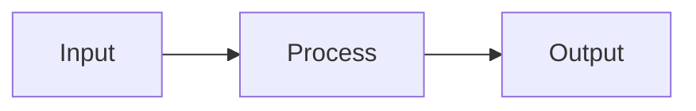

# {{Topic}}

Brief description of the research topic.

---

## 1. Background

Context and motivation for this research.

---

## 2. Key Concepts

### 2.1 Concept A

Explanation with diagram:



### 2.2 Concept B

Explanation with code:

```cpp
// Key algorithm
void algorithm() {
    // Implementation
}
```

---

## 3. Literature Review

| Paper | Authors | Year | Key Contribution |
|-------|---------|------|------------------|
| Paper 1 | Authors | Year | Contribution |
| Paper 2 | Authors | Year | Contribution |

---

## 4. Analysis

### 4.1 Pros

- Pro 1
- Pro 2

### 4.2 Cons

- Con 1
- Con 2

### 4.3 Comparison

| Approach | Performance | Complexity | Memory |
|----------|-------------|------------|--------|
| A | Good | Low | High |
| B | Excellent | High | Low |

---

## 5. Implementation Notes

Practical considerations for VIXEN implementation.

---

## 6. Open Questions

- [ ] Question 1
- [ ] Question 2

---

## 7. References

1. Reference 1
2. Reference 2

---

## 8. Related Pages

- [[../03-Research/Overview|Research Overview]]
- [[Related-Topic-1]]
- [[Related-Topic-2]]
