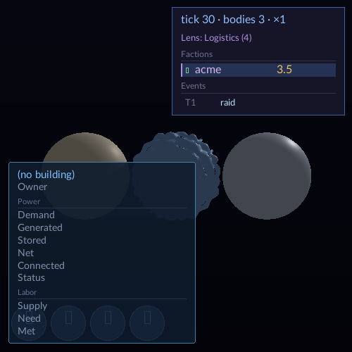

## LANDABLE NOW

- **Merged wave baseline:** `29bd53639f25b9f5afb1c8e4821c4a09435f2144`, with `origin/wave/authoring-convergence` at `7e5d2f65` merged before this run's changes.
- **Implementation commit:** `e842e57b0f90802532eaec551f5469a0b7d37638` (`Declare explicit lighting dispatch dependencies`). The final lane commit also contains this report, its capture evidence, and the two run-3 SPT proposals.
- **Worktree:** `lane-beamflake`; nothing was pushed.

### Missing dependency and fix

The march dispatch `test_dispatch` writes `HitRecordBuffer`. `shadow_visibility_wave` reads and updates that same buffer to add visibility bits. The buffer descriptor is supplied through `sceneProviders`, so descriptor binding alone does not tell `ResourceAccessTracker` that `spatial_reuse` reads `HitRecordBuffer`.

The pointer-order to insertion-order transition exposed the missing ordering. In the controller's comparison, the editor fingerprint changed from `b46c71780f3edd94` to `e4df9879c331ea0e`, moving `shadow_visibility_wave` ahead of `test_dispatch` (indices 83→127 for wave and 122→76 for dispatch); HUD changed from `71c05d728956a5bc` to `e4df9879c331ea0e` (85→127 and 118→76). The resulting RMW ran before the march populated the record.

Run 3's merged wave baseline has editor/HUD fingerprints `f2e3ea8c66320e4e` / `71c05d728956a5bc`; the fixed graph reports `8be0372f7061c599` for both. The fixed order places `test_dispatch` before `shadow_visibility_wave` (editor 121→77 and HUD 118→77; the wave moves to 123 in each graph).

The fix uses the graph's existing forms in [`BuildRenderGraph.cpp`](../VIXEN/application/main/source/graph/BuildRenderGraph.cpp):

- A `BufferSyncGatherer` declares the `spatial_reuse` read of `HitRecordBuffer` (and the optional cell-resolve buffers).
- `test_dispatch.RENDER_COMPLETE_SEMAPHORE` connects to `shadow_visibility_wave.ORDERING_WAIT_SEMAPHORE` on the default path.
- `shadow_visibility_wave.RENDER_COMPLETE_SEMAPHORE` connects to `spatial_reuse.ORDERING_WAIT_SEMAPHORE` when the optional cell-shade chain is absent. When cell resolve is enabled, the existing wave → cell shade → spatial reuse chain provides that order.

These ordering edges are needed because shared-resource tracking does not order separate compute-stage submissions. The test [`LightingDispatchChainSurvivesReversedAndShuffledTieOrders`](../VIXEN/libraries/RenderGraph/tests/test_graph_topology.cpp) checks march → visibility wave → spatial reuse under three reversed/shuffled node tie orders. It checks relative dependencies, not fixed dispatch indices.

### Matched captures

Before and after are fresh Release builds of the merged wave baseline and the fixed tree, using the same DZN ICD and separate `VIXEN_CACHE_DIR` roots. The seven editor/HUD before/after PNG pairs are committed under `reports/beamflake-captures/run3/`.

| Capture(s) | Run-3 byte comparison | Visual review |
|---|---|---|
| `editor_capture_5`, `editor_capture_75` | Both pairs changed. Frames 5/75 are byte-identical within each build. | Before: dark, flat slab and no shaded inner hole wall. After: brighter slab with the inner wall visible and shaded. |
| `editor_capture_45`, `editor_capture_105` | Both pairs changed. Frames 45/105 are byte-identical within each build. | Before: dark flat slab. After: lit slab face. The hole is not visible in either frame at this view. |
| `hud_capture_5`, `_45`, `_75` | All three pairs byte-identical. | The three bodies retain directional shading, including the right body's specular highlight. |
| Starfield headless captures | 4/4 byte-identical. | No scene change. |
| Cornell headless captures | 10/10 byte-identical. | No scene change. |

The run-3 editor baseline was already regressed: its four editor frames match the previous run's dark `after` images byte-for-byte. The fixed run-3 editor frames match the previous run's lit `before` images byte-for-byte. The editor differences here restore the intended lighting; frames 5/75 also restore the shaded inner hole wall. No unrelated capture difference remains. HUD, Starfield, and Cornell stayed byte-identical in this run.

The capture property check is implemented in [`check-lighting-capture-properties.py`](../tools/check-lighting-capture-properties.py). It compares the editor slab-face brightness against the unlit run-3 baseline and checks directional luminance contrast across each HUD body's upper hemisphere. It uses region relationships and thresholds, not golden pixel values. The check passed for editor frame 5 and HUD frame 45.

### Required witnesses

| Witness | Result |
|---|---|
| Fresh Release build at merged baseline | **PASS** — 1,147/1,147 targets. |
| Fresh Release build at fixed tip | **PASS** — 1,147/1,147 targets; all 22 generated checks passed. |
| Lighting topology regression | **PASS** — targeted CTest 1/1. |
| Cornell loop | **PASS** — 50/50. The first queued repeat was externally signaled after five passing runs; the remaining 45 completed in 22 serial batches of two and one batch of one, all passing. |
| Editor gates, including R6 | **PASS** — 9/9 serial tests with a 600-second CTest timeout override. Editor producer 139.48s, HUD producer 35.76s, WSL capture witness 35.41s; all six `EditorToggleUndoCapture` cases passed. |
| Full RenderGraph/SVO selection | **PASS with the allowed T-1449 baseline** — full `-L 'RenderGraph|SVO'` selection completed (2,116 tests counted; one failed). RenderGraph had no failures. The sole SVO failure was `RecipeSimdParity.AllCorpusProgramsAreBitIdenticalAcrossFourLanes`, which reports `M4d_Output_IsPassthrough: recipe gradient capability mismatch: 94`. A targeted rerun reproduced the same opcode-94 signature. |
| No-op rebuild | **PASS** — queued `cmake --build .tmp/after-wave/build/wsl --parallel 4`; Ninja reported no work to do. |

The Release builds also ran all 22 generated writers/checks without generated-file changes. The no-op and test commands used the global queue. The full RenderGraph/SVO run was serial and ran separately from capture jobs.

### STOPs

No unresolved STOP blocks the lighting fix. The only suite red is the documented opcode-94/T-1449 allowance, reproduced by a targeted rerun. CodeGraph exploration was attempted first, but no VIXEN index was available in this worktree.

## CONSOLIDATION ISSUES (non-facade deltas this lane needed)

- Windowed capture output root must exist before log redirection
- Long queued CTest repeat gates need resumable batches
