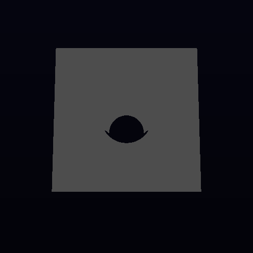
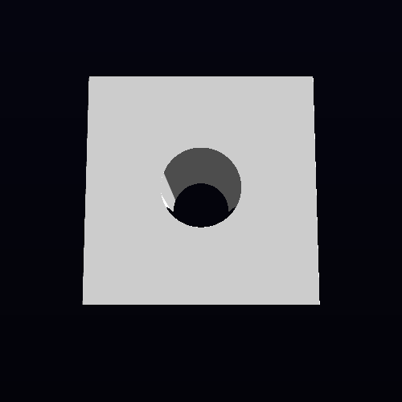
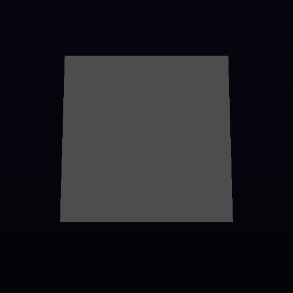
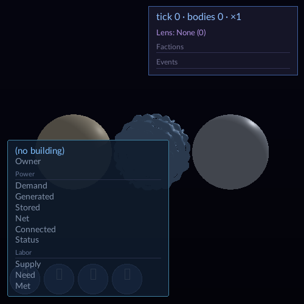
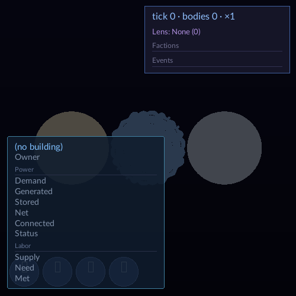
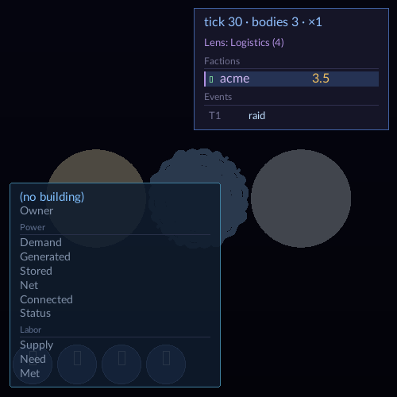
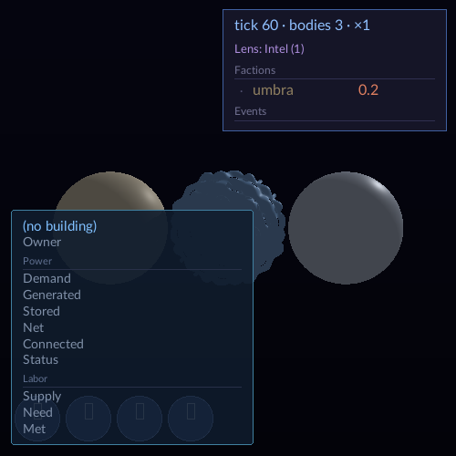
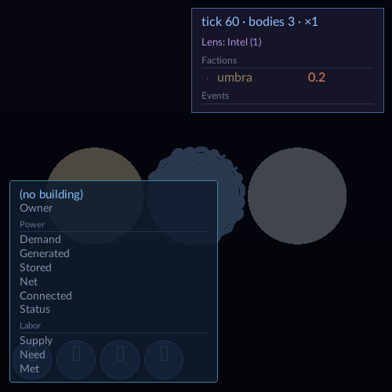

## LANDABLE NOW

- **Merged tip:** `b6ce5a1ccc9caf9de4db1e1a6544b3ae9141075a` (merge of lane `a56b3a06` and `origin/wave/authoring-convergence` at `c0e23a1040357cdf20a337e2d9cbf4170759e70a`). Kernel pin is `c3fb3847979e3f9eef04783510c42b70d7058ae7`.
- **Delta from c0e23a10:** only [`GraphTopology.h`](../VIXEN/libraries/RenderGraph/include/Core/GraphTopology.h), [`GraphTopology.cpp`](../VIXEN/libraries/RenderGraph/src/Core/GraphTopology.cpp#L12) and [`test_graph_topology.cpp`](../VIXEN/libraries/RenderGraph/tests/test_graph_topology.cpp#L166) (35 insertions, 9 deletions). The topology now retains node insertion order and uses it to break ties between otherwise independent nodes; the regression test reverses pointer order and checks the insertion order is preserved.
- **KFR follow-up:** `KernelFederationRenderer/app/src/session_renderer.cpp` is the downstream call site to review. This lane made no KFR edits.
- **CodeGraph:** the required `codegraph explore` was attempted, but no VIXEN index was available; `tools/codegraph-vixen.sh` also reported that the index was unavailable.

### Build and generated checks

| Check | Before (`c0e23a10`) | After (merged tip) |
|---|---:|---:|
| Release configure/build | 1147/1147 targets, pass | 1124/1124 targets, pass |
| 22 generated writers | — | 22/22 ran; no generated-file changes |
| 22 generated checks | — | 22/22 pass |
| `appflow_check`, `view_noun_enum_check` | — | pass on kernel pin `c3fb384` |

Both build trees use a fresh Release configuration and the same SDK/cache paths. The before tree is a detached checkout of the exact `c0e23a10` commit; the after tree is the merged tree. Each runtime used its own `VIXEN_CACHE_DIR` (`.tmp/captures/c0/runtime-cache` and `.tmp/captures/merged/runtime-cache`) and the same DZN Vulkan ICD.

The first baseline configure was interrupted while it attempted to download a duplicate Vulkan SDK. Reconfiguring with the already provisioned Vulkan, windowing, GDB, and FetchContent caches completed successfully; the exact recovery invocation and result are recorded in `.tmp/beamflake-run2-recovery.txt`. The generated writers then ran from source on the merged tree and made no changes.

### Matched capture comparison

Captures were taken from both fresh Release builds with matching scripts, frame settings, display, and DZN ICD. Output was directed to absolute paths and the two runs had isolated runtime caches.

| Capture set | Before | After | Byte comparison |
|---|---:|---:|---|
| Standard native editor/HUD captures | 7 | 7 | 7 changed; individual pairs below |
| Standard Starfield captures | 4 | 4 | 4/4 byte-identical |
| Cornell capture loop inputs | 10 | 10 | 10/10 byte-identical |

The seven differing captures are all native editor/HUD views. In the editor views, the rendered slab/body silhouette, visible surface regions, and occlusion change within the 3D viewport. In HUD views, the same three-body layout and HUD text remain in place; only rendered body surfaces/shading change. The UI and interaction state are unchanged. Each pixel difference is bounded to the rendered viewport: editor captures have bounding box `(103,95)-(397,378)`; HUD captures have `(86,187)-(441,279)`.

The schedule evidence matches the sole source delta. The editor dispatch fingerprint changes from `b46c71780f3edd94` to `e4df9879c331ea0e`; HUD changes from `71c05d728956a5bc` to `e4df9879c331ea0e`. The dispatch precedence counts also shift (`test_dispatch` 122→76 and `shadow_visibility_wave` 83→127 in editor; 118→76 and 85→127 in HUD). The fix changes traversal order for independent graph nodes, so their dispatch order no longer depends on allocation addresses; that restores the geometry previously omitted by the pointer-ordered traversal. Cornell and Starfield are unchanged, and every changed pixel is confined to the render viewport. All seven differences are therefore attributable to the topology-order fix.

| Capture | Changed pixels / 250,000 | Max channel delta | Byte delta | Before | After |
|---|---:|---:|---:|---|---|
| `editor_capture_5.png` | 74,187 | 178 | 7,447 |  |  |
| `editor_capture_45.png` | 81,496 | 178 | 6,558 |  |  |
| `editor_capture_75.png` | 74,187 | 178 | 7,447 |  |  |
| `editor_capture_105.png` | 81,496 | 178 | 6,558 |  |  |
| `hud_capture_5.png` | 4,694 | 148 | 25,100 |  |  |
| `hud_capture_45.png` | 4,694 | 148 | 25,103 |  |  |
| `hud_capture_75.png` | 4,694 | 148 | 25,070 |  |  |

### Required witnesses

| Witness | Result |
|---|---|
| Cornell loop on merged tree | **PASS** — serial `HeadlessCornellGraph` repeat-until-fail 50/50; 0 failures; 4,178.58 sec total |
| RenderGraph and SVO CTest selection | **UNFINISHED at checkpoint** — 1,691/2,116 selected tests completed; `RecipeGlslNumericalParityTest.Hash32GoldenVectorsMatchCpuAndGpuBitwise` was active when stopped. The queued command exited 143 on checkpoint interruption. |
| Editor gates, including R6 | **UNFINISHED** — `vixen_editor_capture_producer` timed out at 180.37 sec; six dependent `EditorToggleUndoCapture` tests, including R6, were `Not Run`. `vixen_hud_capture_producer` passed in 55.43 sec. |
| No-op rebuild | **UNFINISHED** — queued `cmake --build .tmp/merged-c0e23a10-plus-fix/build/wsl --parallel 4` remained memory-blocked and was canceled at checkpoint (wrapper exit 143); it did not run. |

The serial command was `ctest --test-dir .tmp/merged-c0e23a10-plus-fix/build/wsl -L 'RenderGraph|SVO' --output-on-failure --parallel 1`, admitted by the global queue. At the checkpoint it had completed 1,691 of 2,116 selected tests; the CTest command was interrupted with exit 143. The allowed opcode-94 failure was not reached in this partial run. The earlier parallel attempt observed it but also had fixture/process overlap, so that attempt is not a final suite witness. The editor producer reached capture tick 115 and wrote several images before the configured 180-second limit. Retrying with CTest's `--timeout 600` and running the dependent editor gates remain outstanding.

### Recovery and STOPs

- The initial relative capture-output path resolved under the applications' binary working directories and produced `stbi_write_png` errors. Rerunning with an absolute output root produced all expected captures.
- The first quiet windowed-capture job was killed by the queue idle watchdog after it had written its images. Repeating it with a periodic heartbeat completed and verified all seven files.
- **STOP at checkpoint (2026-10-09 21:50 UTC):** stopped the active suite at 1,691/2,116 and canceled the still memory-blocked no-op rebuild. Remaining: recover `vixen_editor_capture_producer` using `ctest --timeout 600`, rerun dependent editor/R6 gates, finish the remaining 425 selected tests (including the opcode-94 case and serial calibration-store tests), then run the no-op rebuild. No capture difference was unattributed.

## SPT DISPOSITION

Six incidental workflow issues were filed through the SPT proposal CLI and are committed in `.spt-proposals/beamflake.jsonl`. No SPT task was created.

## CONSOLIDATION ISSUES

- Share provisioned Vulkan SDK paths with detached VIXEN baseline worktrees
- Windowed capture runner requires an absolute output directory
- Queue needs progress signaling for quiet long-running VIXEN captures
- Calibration store tests share temp files across parallel CTest cases
- Editor capture CTests lack cross-process serialization for shared artifacts
- Windowed capture producer CTest timeout is below real DZN runtime
