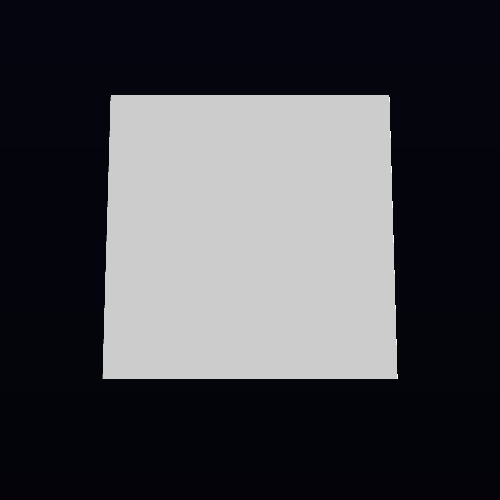

# carvefix — editor carved-layer exactness

## LANDABLE NOW

**State: STOP — editor image exactness remains unresolved.** The reported missing cavity is not present in the measured geometry. The slab’s carved opening is present in the wave reference and in the merged editor captures. The four editor images still have stable shading differences from wave; no evidence establishes those differences as genuine precision changes, so this report does not label them that way.

### Tips and scope

- Reproduction tree: VIXEN `7e63dbce` (`lane-wavebump`), with kernel pin `c3fb384`.
- Final merged VIXEN tree: `ef3f1312` (`lane-carvefix`), including `origin/wave/authoring-convergence`.
- Assigned kernel tree: `e8a1fdc0`, fast-forwarded to `origin/main`; this lane made no kernel edits. VIXEN continues to use its tracked `c3fb384` snapshot.
- First Release capture mismatch: queued native captures on `7e63dbce` (`1791559066` and absolute-root recovery `1791559148`), compared to `reports/wavebump-visual/captures/wave` (`1791559253`). The clean Release build on that base passed (`1791558432`).

### Cause and fix

The layered SDF keeps the subtract operation. Its serialized recipe is `Box(slab), Sphere(cutter), Subtract`; the generated interval specializer removes the cutter only on a tile where it proves the cutter irrelevant. A 9×9×9 FP32 probe compares the specialized result with `evalRecipe` by bit pattern. The guarded occupancy reduction also matches its dense unguarded oracle byte for byte. The GPU render has open center rays and nonzero slab hits.

The capture masks agree on the cavity. On editor frame 5, both wave and current have the same 3,010-pixel central bore mask and the same object-support mask. On frame 45, both have no bore because the scripted editor state has the cut layer disabled. The visual claim of a lost subtract layer is therefore unsupported by these captures.

No production SDF change was made. The lane adds a layered `.vxd` regression that loads through `EditorDocumentModel`, flattens the two layers, checks interval and occupancy guards against unguarded oracles, then renders and asserts a center opening plus remaining slab hits. It uses a property assertion, not a pinned image. The test target links `VoxelDocument` so the fixture exercises the editor document API.

The mandatory authoring-wave merge also includes the separate `RenderGraph::RecompileDirtyNodes` device-idle fix from `5d247093` and stages the capture document in the build tree. The final editor PNG hashes equal the earlier `7e63dbce` merged-capture hashes, so this merge did not remove the measured editor shading delta.

### Candidate bisect

| Candidate | Isolation evidence | Result for the carved layer |
|---|---|---|
| Kernel pin `77574f2` → `c3fb384` | The kernel diff is in `CodegenTool` and `SourceGenerator` (including the recipe-analysis emitter); it does not alter a canonical SDF implementation. The pin selects code-generation inputs. VIXEN runtime behavior comes from the generated artifacts, which are isolated in the rows below. | No runtime pin-only path erases the subtract operation. The cavity mask remains present. |
| Boundscore consumer transfers and guards | Reverting the old `RecipeBounds` consumer alone produced all seven PNGs byte-identical to the guarded capture. Reverting the complete consumer/generated-artifact bundle also left all seven PNGs byte-identical to the guarded capture. Logs: `1791560139`, `1791560385`, `1791561399`, `1791561501`. | Not the source of a dropped subtract layer. |
| `precise` qualifiers in `SdfCoreKernels.g.glsl` | Reverting the qualifiers and rebuilding produced seven PNGs byte-identical to the current guarded capture. Logs: `1791559701`, `1791559770`. | Not the source of the cavity report or the remaining image delta. |
| Wavereds `RecipeSimd.g.hpp` and generated GLSL | The all-off artifact experiment included the old `RecipeSimd.g.hpp`, old GLSL, and related generated files. All seven captures remained byte-identical to the guarded run. This isolates the artifact bundle; it does not claim a per-file timing or precision attribution. | No geometry loss in the bundle experiment. |
| Corpus helper fix | The native sample does not use the typed corpus helper; its runtime parameter path uses `ReadParam`. The helper is exercised by corpus tests, not by the editor capture. | No production path from this fix to the carved layer. |

Across the candidate experiments, none changed the carved geometry mask. The exact cause of the stable editor shading delta remains unclassified.

### Capture comparison and images

The final merged-tree capture used Release binaries and an isolated worktree-local `VIXEN_CACHE_DIR`. HUD output was byte-identical to wave (0 shader hits / 9 misses for the first HUD run). The editor run then reused that fresh cache (8 hits / 1 miss).

| Capture | Final vs wave | Pixel difference | Maximum channel delta | Bounds |
|---|---:|---:|---:|---|
| Editor 5 / 75 | 7,447 bytes | 74,187 / 250,000 | 178 | x=103..397, y=95..378 |
| Editor 45 / 105 | 6,558 bytes | 81,496 / 250,000 | 178 | x=103..397, y=95..378 |
| HUD 5 / 45 / 75 | 0 bytes | 0 / 250,000 | 0 | none |

Final editor hashes are `14a4264775cb4edddf755147dac2c9cad1b5aba5176242b87f838476c4e977a5` (frames 5/75) and `ed362a4235d54e8120fb0e109a7f2ae53d01053d76a7fe9a4e84a8f74068e054` (frames 45/105). These match the earlier merged-capture hashes. The seven final images are saved in `carvefix-visual/captures/current/`.

| Wave reference, frame 5 | Original merged capture, frame 5 | Final merged capture, frame 5 |
|---|---|---|
|  |  |  |

| Wave reference, frame 45 | Original merged capture, frame 45 | Final merged capture, frame 45 |
|---|---|---|
|  |  |  |

### Regression and verification

- Layered slab/subtract-sphere regression: `EditorDocumentRenderTest.LayeredSlabSubtractSphereGuardsAreExactAndCaptureHasHole` passed. Build log `1791563909`; test log `1791563978`.
- All 22 generated checks plus `no_new_mutex_check`: passed; Ninja reported no work. Log `1791563997`.
- Full serial RenderGraph: 1,344 selected, 0 failed, 11 skipped. Log `1791564005`.
- Full serial SVO: 761 passed, 1 failed, 8 skipped, 1 disabled. The sole failure is the documented T-1449 case `RecipeSimdParity.AllCorpusProgramsAreBitIdenticalAcrossFourLanes`, diagnostic `M4d_Output_IsPassthrough: recipe gradient capability mismatch: 94`. Log `1791565191`.
- Occupancy exactness: `RecipeOccupancy.GeneratedReductionMatchesOracleAndMeasuresCellWork` passed all fixtures against the dense oracle. Log `1791564846`.
- rvcompact identity: `DeclaredPositionRenderTest.IntervalPrunedTileTapesMatchFullAndUnrolledGpuPixels` passed with byte-identical full/pruned/unrolled outputs. Log `1791565166`.
- Merged kernel Release test-project builds passed with zero warnings/errors. SourceGenerator tests passed 981/981; CodegenTool tests passed 2,087 with 2 skipped. Logs: `1791565345`, `1791565794`, `1791565830`, `1791565947`.
- Final native captures completed; HUD matched wave and editor deltas are detailed above. Logs: `1791566948`, `1791567148`.
- Final no-op Release rebuild passed; Ninja reported no work. Log `1791567262`.
- The capture left `sample_tri_layer.edited.vxd` unchanged at SHA-256 `61944efc2220d22976d79ad2e932252a9e189fc42d49d1f6afbf70db64dca3d8`.

### STOPs and disposition

- **STOP — editor image exactness:** all four editor images still differ from wave by the shading counts above. The cavity mask is identical, and the listed kernel/boundscore/generated-artifact candidates do not drop the subtract layer. The mismatch is not demonstrated to be genuine precision. The prior wavebump report records R458 approval for the editor visual change; the orchestrator must decide whether that approval satisfies this stricter byte-identity gate or whether a source-level shading fix is required. No baseline was re-captured or replaced.
- **Known SVO exception:** T-1449/opcode 94 is the only SVO failure; it is the exact documented diagnostic. All other selected SVO cases passed or skipped.
- No baseline-unobtainable condition applies. The requested geometry regression and its scoped witnesses pass.

## CONSOLIDATION ISSUES (non-facade deltas this lane needed)

- proposed: Resolve native capture output root before changing application directories
- proposed: Expose progress while native capture logs are redirected
- proposed: RenderGraph editor document fixtures need an explicit VoxelDocument link
- proposed: Isolate the runtime cache for native capture byte witnesses
- proposed: CodegenTool fixture tests should resolve their Undertow schema root
