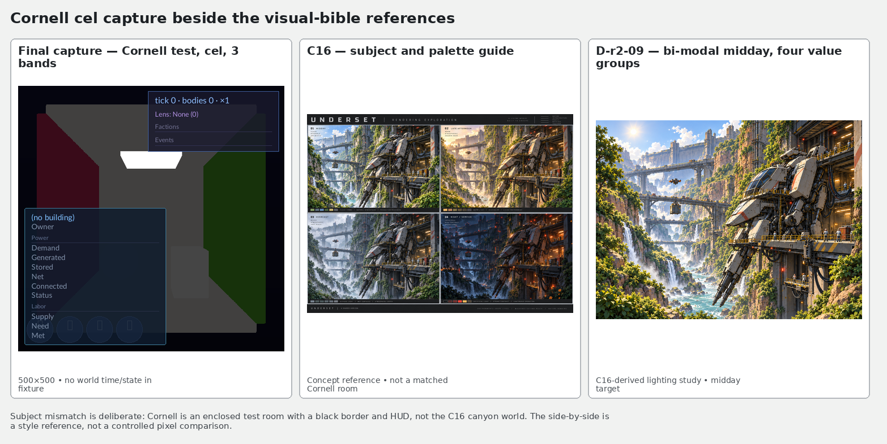
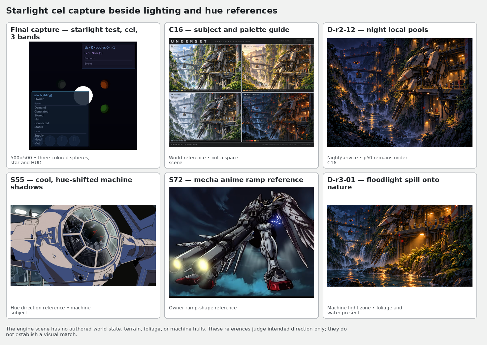
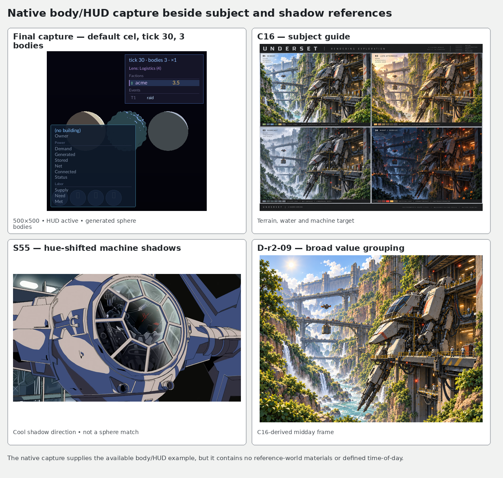
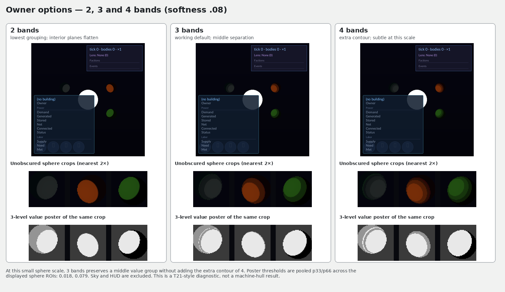
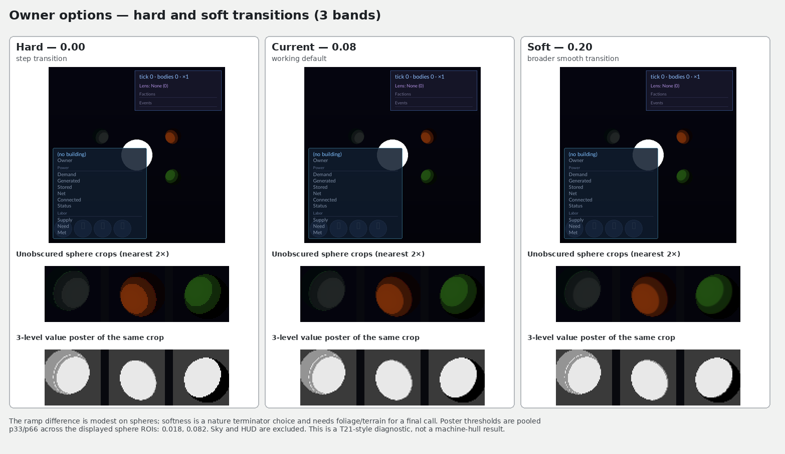

# Cel shading lane report

## Run 1 mechanism record

Body shading lives in `VIXEN/shaders/SpatialReuseShade.comp`. `computeLightingWithShadows` selects Lambert+GGX for `shadingMode=0` and the new bi-modal cel path for `shadingMode=1`. The runtime values come from `LightingConfigNode` in `VulkanGraphApplication::BuildRenderGraph()` and are uploaded each frame by `LightingConfigNode::TypedExecuteImpl`. The generated schema keeps the original 32-byte `Light` stride and stores per-light spill-purpose scales alongside the shared light array.

`shadingMode` defaults to cel (`1`), and Lambert+GGX remains selectable as `0`. `celBandCount` defaults to `3` and clamps to `2` through `5`; `celBandFalloffStart` and `celBandFalloffEnd` default to `0`, clamp to `0` through `1,000,000`, and disable distance falloff when the end is not greater than the start. `celShadowThreshold` defaults to `0.16` and `celLitThreshold` to `0.86`; each clamps to `0` through `1`, and an invalid ordering restores those defaults. `celRampSoftness` defaults to `0.08` and clamps to `0` through `0.5`. `celLitHueShiftDegrees` defaults to `+18` and `celShadowHueShiftDegrees` to `-18`; the hue rotation preserves saturation and value, and shifts wrap to `[-180, 180]`. The ramp assigns 70 percent to the major lit hue and 30 percent to the minor shadow hue. `celLightSpillScale` defaults to `0.012` and clamps to `0` through `0.25`; spill multiplies source luminance, per-light purpose scale, this node parameter, and light attenuation. Purpose scale defaults to `1.0`, clamps to `0` through `4`, and the starlight point source supplies `1.5`. The cel loop consumes every light in the shared set, including the default directional source and starlight point sources.

The baseline Cornell image and final Lambert+GGX Cornell image are byte-identical. The baseline and final Lambert+GGX starfield images are byte-identical as well.

 

 

Cel captures cover Cornell at three bands and the star scene at two, three, and five bands. The mode-switch fixture also captured both cel and Lambert+GGX selections.

  

 

The canonical legacy capture set is byte-identical to base `c439440f`: four native editor captures, three native HUD captures, two Cornell captures, and two starfield captures. Three additional RenderGraph HUD captures are byte-identical too. The separate offscreen editor fixture passes as a producer but its four images differ from the saved baseline fixture: frames 5 and 75 differ in 94 pixels, and frames 45 and 105 differ in 1,024 pixels, all within `x=234..265, y=232..263`. I restored the exact base `c439440f` lighting files, rebuilt `vixen_editor` through the queue, and reran the same offscreen script. It reproduced the same four mismatch counts and bounds, proving this fixture red exists on the recorded base. A mode-0 shader canary confirmed that fixture executes the Lambert+GGX branch.

 

The hue demonstration sample from `stars-3-bands-3.png` is RGB `(118, 45, 8)` at pixel `(338, 196)` on the lit side, with hue `20.2°`. The shadow-side sample is RGB `(21, 3, 4)` at `(365, 208)`, with hue `356.7°`.

The queued full build passed all 96 steps, including the generated layout checks. The RenderGraph CTest suite passed 1,340/1,340 with five existing skips. After the final lane rebuild, the combined focused cel and canonical capture run passed 13/13, covering band quantization, mode switching, parameter bounds, cel captures, Cornell and starfield legacy captures, native editor production, and the WSL capture witness. The SVO suite reproduced its baseline red: 751 tests ran and `RecipeSimdParity.AllCorpusProgramsAreBitIdenticalAcrossFourLanes` failed on opcode 94 with `M4d_Output_IsPassthrough: recipe gradient capability mismatch: 94`.

The KFR follow-up should expose these renderer parameters from `KernelFederationRenderer/app/src/session_renderer.cpp`, inside `SessionRenderer::BuildRenderGraph()`. KFR was not edited.

## Run 2 visual pass (R427)

The lane merged `origin/wave/authoring-convergence` at `ecceaf45` before this pass. The visual witness ran on merged tree `595617252f89e6590da68165ceeeba81f774bee0`. The only source change for this run is a capture-fixture override for ramp softness in [test_cel_shading_graph.cpp](../VIXEN/application/main/tests/test_cel_shading_graph.cpp); renderer logic and renderer defaults are unchanged.

### T-ids and references used

T-ids judged: **T01, T04, T06, T07, T13, T16, T21**. The image check follows visual-bible §7 and the owner decisions R419.2, R419.3, R419.7, R419.10, and R419.12.

| Reference | Path | What I judged from it |
|---|---|---|
| C16 | `/home/liory/codeman-cases/undertow/reports/visual/images/C16.png` | Subject and derived-palette guide across midday, late afternoon, overcast, and night/service; supplies the luma targets. |
| D-r2-09 | `/home/liory/codeman-cases/undertow/reports/visual/iterations/lighting/r2-09-bimodal-midday-four-groups.png` | Broad bi-modal value groups on the C16 scene; measured 0.0781 / 0.4109 / 0.9129 against 0.07 / 0.38 / 0.88 midday targets. |
| D-r2-12 | `/home/liory/codeman-cases/undertow/reports/visual/iterations/lighting/r2-12-bimodal-night-local-pools.png` | Local night pools along terrain and water; measured 0.0017 / 0.1205 / 0.4257. |
| D-r3-01 | `/home/liory/codeman-cases/undertow/reports/visual/iterations/lighting/r3-01-bimodal-floodlight-nature.png` | A machine floodlight visibly reaching nature; the frame lifts night p95 to 0.5193. |
| S55 | `/home/liory/codeman-cases/undertow/reports/visual/images/S55.png` | Cool, hue-shifted machine shadow planes. |
| S72 | `/home/liory/codeman-cases/undertow/reports/visual/images/S72.png` | Mecha-anime ramp and contrast cue; used as an owner-facing shape reference, not a pixel match. |

### Captures and contact sheets

All final scene captures are 500×500 RGB. Cornell and starlight are offscreen cel captures. The native VIXEN body/HUD capture is at tick 30 with three generated bodies and no legacy-mode override. Scene state, distance regime, star type, and atmosphere are not defined by these test fixtures; the starlight scene is only a space-like/night analogue.

The only available subjects are a Cornell test room, a star plus three simple colored spheres, and three simple generated sphere bodies behind the screen-space HUD. There is no terrain, foliage, water, machine hull, human-scale object, faction site, or extraction scar. The comparisons above show the requested references next to the engine captures; they are not presented as matched subjects.

### §7 frame measurements

The measurements use the bible snippet: display-referred Rec.709 luma from encoded sRGB, full-frame percentiles via `numpy.percentile`, and the screenshot proxy `V > .85 && S > .45` for emissive share. The proxy does not identify actual emissive materials.

| Capture | Nearest C16 target used for context | Luma p5 / p50 / p95 | Emissive-pixel proxy | Luma ≥ .98 share |
|---|---|---:|---:|---:|
| Cornell, cel 3-band | Midday 0.07 / 0.38 / 0.88 (room has no TOD) | 0.0137 / 0.1242 / 0.2706 | 0.0620% | 1.3808% |
| Starlight, cel 3-band | Night/service 0.03 / 0.15 / 0.40 (space-like analogue only) | 0.0137 / 0.0222 / 0.2021 | 0.0608% | 0.8080% |
| Native body/HUD, tick 30 | Night/service 0.03 / 0.15 / 0.40 (no state is configured) | 0.0137 / 0.0874 / 0.2776 | 0.0728% | 0.0324% |

These are raw diagnostics, not valid C16 state comparisons. The black backdrop and HUD dominate the frame percentiles, so tuning cel thresholds or spill to force them toward the world targets would overfit the fixtures. Cornell has a small white ceiling patch but no broad clipped field; the measured luma≥.98 share is 1.3808%. The other two clipped shares are 0.8080% and 0.0324%.

On the orange sphere in the starlight capture, the lit sample at `(338,196)` is RGB `(118,45,8)`, HSV hue 19.8°, saturation 0.929, value 0.463. The shadow sample at `(365,208)` is RGB `(21,3,4)`, hue 355.8°, saturation 0.855, value 0.082, luma 0.0271: shortest hue delta **24°**. It remains visibly chromatic, so the hue-shift condition passes on this sample; its value is still near-black. Hue rotation cannot raise that value. A brighter shadow floor needs a matched world and ambient/exposure tuning; the current ambient value is shared with Lambert+GGX and changing it here would invalidate the legacy comparison. A global hue rotation also cannot turn every material into S55's cool blue shadow, so the shadow hue remains provisional until real machine materials are available.

### §7 table

| Step | Status | Evidence / observation |
|---|---|---|
| 1. Log the frame | PASS | Resolution and visible contents are logged above. TOD, scene number, distance regime, star type, and atmosphere are recorded as unspecified where the fixtures do not define them. |
| 2. Shared light set | PASS | Surface shaders consume the same `LightingConfigNode` light array. These fixtures do not exercise multiple domains or prove every shadow relationship visually. |
| 3. Value range | FAIL* | Raw values in the table fall below the nearest C16 targets. `*` The fixtures have no matching C16 state, so this is not a valid world-lighting verdict. |
| 4. Depth by haze | N/A | No atmosphere or far terrain. The starlight fixture is airless but does not define a world-scale depth check. |
| 5. Domain split | N/A | No nature or machinery. |
| 6. Voxel step | N/A | No foliage, rock, or excavation surface. |
| 7. Intrusion read | N/A | No faction site or biome. |
| 8. Machine lights | N/A | No machine emitters or floodlight pools. The listed emissive shares are only screenshot proxies. |
| 9. Weight | N/A | No machine or human-scale reference object. |
| 10. Silhouette | N/A | No hero machine or structure. |
| 11. Materials | N/A | Test walls and spheres do not provide rock, metal, ice, and vegetation. |
| 12. Scale | N/A | No familiar scale object. |
| 13. Clean frame | FAIL | Every scene capture includes an abstract screen-space HUD; there is no UI-free world capture in the current fixtures. |
| 14. Hull colour | N/A | No machine hull to judge the 70/30 colour split or shadow treatment on plates. |
| 15. Edges | N/A | No terrain, foliage, excavation, or machine plates. |
| 16. Extraction read | N/A | No mined site or untouched biome comparison. |

**Summary:** 2 PASS, 2 FAIL, 12 N/A. The FAILs are the invalid raw value-range comparison and the visible HUD overlay; only the shared-light-set path is a renderer-level pass.

The next useful scene is a C16-style world with rock cliffs, foliage, water, one 70/30-painted machine, a worker for scale, a visible sodium floodlight, and a mining scar beside untouched terrain. It needs fixed camera/exposure captures for all four C16 states. That scene would let §7 judge haze, soft nature terminators, machine hue groups, light spill, weight, scale, and extraction without treating the test backdrops as world values.

### Owner option sheets and working defaults

R419.10 and R419.12 leave band count and the 80s-anime ramp with the owner. These sheets show 2, 3, and 4 bands, plus hard, current, and soft ramp settings. The three-level poster is limited to unobscured sphere crops: the band sheet uses pooled ROI p33/p66 thresholds 0.0182 / 0.0793, and the ramp sheet uses 0.0182 / 0.0824. Both are T21 diagnostics, not machine-hull passes.

The working default remains **3 bands**: 2 loses the middle contour; 4 adds another contour but it is subtle at this object scale. Across the 500×500 full captures, 2→3 changes 1,629 pixels (mean absolute channel delta 0.106/255; max 52/255) and 3→4 changes 2,093 pixels (0.059/255; max 35/255). The 3-level ROI poster shows broad groups in all three, but this is sphere evidence only.

The working ramp default remains **softness 0.08**. Hard `0.00` uses a step; `0.20` gives a wider smooth transition; the current value is a modest middle setting. Hard→0.20 changes 544 full-frame pixels (mean 0.009/255); 0.08→hard changes 224; 0.08→0.20 changes 540. The difference is modest on spheres, so the owner should tune the nature terminator on foliage and terrain.

| Parameter | Working value | Decision |
|---|---:|---|
| Mode | Cel `1` | Keep default; Lambert+GGX remains selectable as `0`. |
| Band count | `3` | Middle option; provisional owner-facing default. |
| Shadow / lit thresholds | `0.16 / 0.86` | Retain; current fixtures cannot identify better world thresholds. |
| Ramp softness | `0.08` | Retain as a middle setting; owner should compare against foliage. |
| Lit / shadow hue shift | `+18° / −18°` | Retain; the orange sphere shows a 24° chromatic shift without desaturating to grey. |
| Light spill scale | `0.012` | Retain; no machine floodlight or nature surface to tune against. |
| Band distance falloff | `0 / 0` | Disabled; no distance-regime scene to justify it. |

No renderer default changed in this pass. The band and ramp selections are working defaults for the owner to review; threshold, hue-shift, and spill tuning needs the missing world scene. The current ambient intensity is 0.3 and is shared by both shading modes.

### Final witness

- Merged wave: `origin/wave/authoring-convergence` at `ecceaf45`; merged tree at witness start: `595617252f89e6590da68165ceeeba81f774bee0`.
- Fresh configure: queued `env VIXEN_FETCHCONTENT_CACHE=$PWD/.tmp/fetch cmake -S VIXEN -B build/wsl`, exit 0; pinned kernel snapshot and Undertow schema catalogue were found.
- Full queued build: exit 0. The updated VoxelDocument/editor/test targets compiled; 12 incremental build steps ran.
- All 22 `*_check` targets were invoked through the queue and returned success with no dirty generated work. The direct pinned CodegenTool `dotnet run ... --check` also returned 0 before the fixture-only edit; generated outputs were unchanged.
- `ctest -L RenderGraph`: **1,339 passed, 0 failed**, 5 skipped.
- `ctest -L SVO`: 752 labeled, 751 run; one failure, `RecipeSimdParity.AllCorpusProgramsAreBitIdenticalAcrossFourLanes`, with `M4d_Output_IsPassthrough: recipe gradient capability mismatch: 94` (T-1449). This exact failure is recorded at the pre-merge lane tip `a6fc915d` and in the clean-wave witness; it is outside this cel shading scope. No other SVO test failed.
- Focused cel tests: **7/7 passed**. Band/ramp option captures: **5/5 passed**.
- Native windowed captures with display/Vulkan variables unset: **7/7 byte-identical** against `.tmp/celshade-captures/before/native`. The RenderGraph editor/HUD set also matches its saved baseline **7/7**. Headless Lambert+GGX Cornell and starfield-off captures both match the saved baseline byte-for-byte.
- Capture witness selection: **11/11 standard capture checks passed** (editor/HUD producers and assertions plus offscreen UI/Cornell), along with the three extra headless starfield checks: **14/14 total**. All 22 check targets, build/test commands, and captures used the global box queue.
- Runtime manifest: no tracked cache-manifest change.
- STOPs: **none**. The SVO opcode-94 failure is the documented unrelated finding above.

## SPT DISPOSITION

The capture softness override reuses the existing “Allow capture tests to override existing node parameters” proposal; no duplicate was filed. I added one new proposal because the native runner hard-codes Lambert+GGX and capturing the default-cel HUD scene required a direct app launch plus a copied `LD_LIBRARY_PATH` setup. The std430 tail-padding proposal also remains in this lane's SPT inbox from Run 1.

## CONSOLIDATION ISSUES

- proposed: Support declarative std430 tail padding in config codegen
- proposed: Allow capture tests to override existing node parameters
- proposed: Let windowed captures select the shading mode
