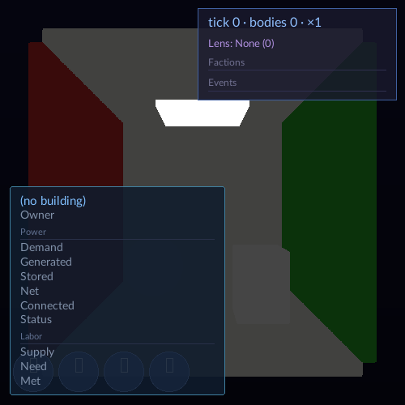
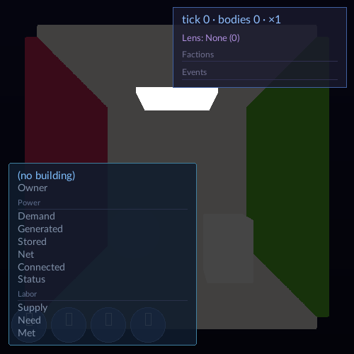
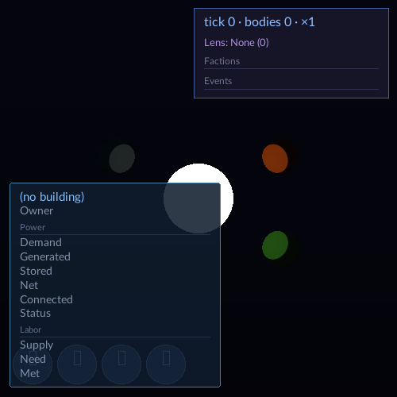
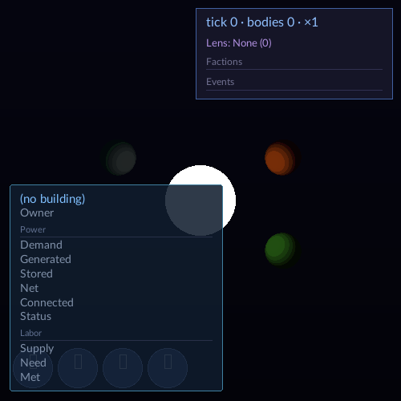
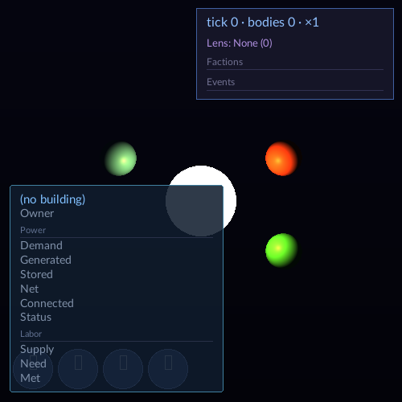
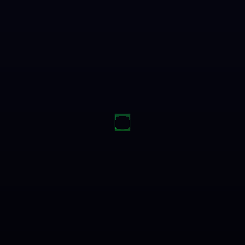
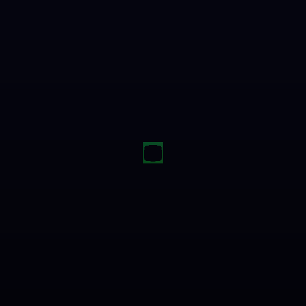

# Cel shading lane report

Body shading lives in `VIXEN/shaders/SpatialReuseShade.comp`. `computeLightingWithShadows` selects Lambert+GGX for `shadingMode=0` and the new bi-modal cel path for `shadingMode=1`. The runtime values come from `LightingConfigNode` in `VulkanGraphApplication::BuildRenderGraph()` and are uploaded each frame by `LightingConfigNode::TypedExecuteImpl`. The generated schema keeps the original 32-byte `Light` stride and stores per-light spill-purpose scales alongside the shared light array.

`shadingMode` defaults to cel (`1`), and Lambert+GGX remains selectable as `0`. `celBandCount` defaults to `3` and clamps to `2` through `5`; `celBandFalloffStart` and `celBandFalloffEnd` default to `0`, clamp to `0` through `1,000,000`, and disable distance falloff when the end is not greater than the start. `celShadowThreshold` defaults to `0.16` and `celLitThreshold` to `0.86`; each clamps to `0` through `1`, and an invalid ordering restores those defaults. `celRampSoftness` defaults to `0.08` and clamps to `0` through `0.5`. `celLitHueShiftDegrees` defaults to `+18` and `celShadowHueShiftDegrees` to `-18`; the hue rotation preserves saturation and value, and shifts wrap to `[-180, 180]`. The ramp assigns 70 percent to the major lit hue and 30 percent to the minor shadow hue. `celLightSpillScale` defaults to `0.012` and clamps to `0` through `0.25`; spill multiplies source luminance, per-light purpose scale, this node parameter, and light attenuation. Purpose scale defaults to `1.0`, clamps to `0` through `4`, and the starlight point source supplies `1.5`. The cel loop consumes every light in the shared set, including the default directional source and starlight point sources.

The baseline Cornell image and final Lambert+GGX Cornell image are byte-identical. The baseline and final Lambert+GGX starfield images are byte-identical as well.

 

 

Cel captures cover Cornell at three bands and the star scene at two, three, and five bands. The mode-switch fixture also captured both cel and Lambert+GGX selections.

  

 

The canonical legacy capture set is byte-identical to base `c439440f`: four native editor captures, three native HUD captures, two Cornell captures, and two starfield captures. Three additional RenderGraph HUD captures are byte-identical too. The separate offscreen editor fixture passes as a producer but its four images differ from the saved baseline fixture: frames 5 and 75 differ in 94 pixels, and frames 45 and 105 differ in 1,024 pixels, all within `x=234..265, y=232..263`. I restored the exact base `c439440f` lighting files, rebuilt `vixen_editor` through the queue, and reran the same offscreen script. It reproduced the same four mismatch counts and bounds, proving this fixture red exists on the recorded base. A mode-0 shader canary confirmed that fixture executes the Lambert+GGX branch.

 

The hue demonstration sample from `stars-3-bands-3.png` is RGB `(118, 45, 8)` at pixel `(338, 196)` on the lit side, with hue `20.2°`. The shadow-side sample is RGB `(21, 3, 4)` at `(365, 208)`, with hue `356.7°`.

The queued full build passed all 96 steps, including the generated layout checks. The RenderGraph CTest suite passed 1,340/1,340 with five existing skips. After the final lane rebuild, the combined focused cel and canonical capture run passed 13/13, covering band quantization, mode switching, parameter bounds, cel captures, Cornell and starfield legacy captures, native editor production, and the WSL capture witness. The SVO suite reproduced its baseline red: 751 tests ran and `RecipeSimdParity.AllCorpusProgramsAreBitIdenticalAcrossFourLanes` failed on opcode 94 with `M4d_Output_IsPassthrough: recipe gradient capability mismatch: 94`.

The KFR follow-up should expose these renderer parameters from `KernelFederationRenderer/app/src/session_renderer.cpp`, inside `SessionRenderer::BuildRenderGraph()`. KFR was not edited.

## CONSOLIDATION ISSUES

- proposed: Support declarative std430 tail padding in config codegen
- proposed: Allow capture tests to override existing node parameters
