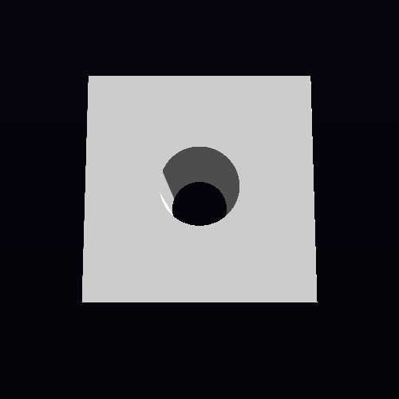

# R464 — black crescent and white strip at the editor bowl rim

## LANDABLE NOW

**Result:** fixed the editor's black rim crescent by giving procedural SDF rays enough iterations to reach the surface and requiring a tighter surface distance before declaring a hit. The captured white strip is produced by the configured cel-lighting band on a valid cylinder-wall normal; the sampled normal is finite and agrees with the analytic inward cylinder normal. No color clamp or image baseline change was made.

**Base:** `c0e23a1040357cdf20a337e2d9cbf4170759e70a` (`origin/wave/authoring-convergence`).

### Reproduction and fixture geometry

The matched Release frame-5 capture is a 500×500 editor view. The fixture's actual recipe is `Box(1,1,1)`, `Sphere(0.6)` joined with `SmoothUnion(0.15)`, then `MathSub(Cylinder(halfHeight=1.5,radius=0.35))`. The sphere lies fully inside the box, so the visible opening is the vertical cylinder bore; it is not a spherical bowl. The bore extends beyond the slab's top and bottom faces.

An analytic ray/box-minus-cylinder oracle classifies every opening pixel. Of the 7,820 pixels inside the projected bore outline, 4,858 first hit the inner cylinder wall and 2,962 really pass through the bore. Across all 250,000 pixels, the final analytic mask has zero hit/miss mismatches. The center pixel `(249,249)` is a true through-ray; the entire black disc is therefore not a defect. The ring of pixels that should see the inner wall is not supposed to be black.

The source test records each ray's outcome, iteration count, exit reason, final SDF and finite-difference gradient, hit normal, ray interval, last step, and grid dimension. The editor fixture reports `gridDim=0`, so voxel/brick levels are not applicable. A separate gridded fixture (`gridDim=16`) checks occupancy culling against its unguarded render oracle.

### Ray traces

Termination codes: `1` = within hit epsilon, `2` = marched beyond the ray's far bound, `3` = exhausted `MAX_STEPS`. Gradient values below are the unnormalized central-difference gradient; normals are separately normalized.

| Pixel / sample | Before | After | Interpretation |
|---|---|---|---|
| Left crescent `(210,260)` | miss, 128 steps, termination 3, `sdf=0.00149658322`, gradient `(0.00191387534,0,-0.00058054924)`, `gridDim=0`, voxel/brick N/A | hit, 312 steps, termination 1, `sdf=4.88758087e-6`, gradient `(0.0019223392,0,-0.000551849604)`, normal `(0.961178541,0,-0.275927365)`, `N·L=0.714243412`, `gridDim=0`, voxel/brick N/A | A real rim surface; previously stopped above it. |
| Right crescent `(289,260)` | miss, 128 steps, termination 3, `sdf=0.00149661303`, gradient `(-0.00191387534,0,-0.00058054924)`, `gridDim=0`, voxel/brick N/A | hit, 312 steps, termination 1, `sdf=4.88758087e-6`, gradient `(-0.0019223392,0,-0.000551849604)`, normal `(-0.961178541,0,-0.275927365)`, `N·L=0`, `gridDim=0`, voxel/brick N/A | The opposite rim surface; ambient-only output is gray. |
| Bore center `(249,249)` | miss, 13 steps, termination 2, `sdf=0.625681281`, gradient `(0,-0.00200009346,0)`, `gridDim=0`, voxel/brick N/A | miss, 13 steps, termination 2, `sdf=0.625681281`, gradient `(0,-0.00200009346,0)`, `gridDim=0`, voxel/brick N/A | Correct true escape through the long cutter. |
| Bore wall `(243,228)` | hit, 41 steps, termination 1, `sdf=0.0009547472`, gradient `(0.000383943319,0,0.00196278095)`, normal `(0.191973552,0,0.981400132)`, `N·L=0`, `gridDim=0`, voxel/brick N/A | hit, 77 steps, termination 1, `sdf=4.29153442e-6`, gradient `(0.000383257866,0,0.00196292996)`, normal `(0.191629395,0,0.981467366)`, `N·L=0`, `gridDim=0`, voxel/brick N/A | Correct visible inner wall; the stricter epsilon improves the surface hit. |
| Bore/rim wall `(241,184)` | hit, 6 steps, termination 1, `sdf=0.000956565142`, gradient `(0.000343352556,0,0.00197029114)`, normal `(0.171677604,0,0.985153198)`, `N·L=0`, `gridDim=0`, voxel/brick N/A | hit, 30 steps, termination 1, `sdf=4.14252281e-6`, gradient `(0.000342726707,0,0.00197038054)`, normal `(0.171366319,0,0.985207379)`, `N·L=0`, `gridDim=0`, voxel/brick N/A | Correct cylinder-wall hit. |
| White strip `(206,255)` | hit, 104 steps, termination 1, `sdf=0.000997424126`, gradient `(0.00187602639,0,-0.000693112612)`, normal `(0.938027263,0,-0.346561521)`, `N·L=0.741657674`, `gridDim=0`, voxel/brick N/A | hit, 297 steps, termination 1, `sdf=4.88758087e-6`, gradient `(0.00188443065,0,-0.000669926405)`, normal `(0.94222939,0,-0.334968209)`, `N·L=0.737390399`, `gridDim=0`, voxel/brick N/A | Finite, analytic cylinder normal with a valid positive lighting response. |

The baseline frame had 196 analytic mask disagreements (80 misses and 116 false hits). After the fix it has zero. The unguarded and guarded editor recipe have identical hit bits and RGBA for every pixel; this particular recipe does not dispatch an occupancy grid. In the separate `gridDim=16` slab/sphere fixture, guarded and unguarded hit bits and RGBA are also identical per pixel, with zero analytic mismatches. Its internal hit-record fields are not bitwise identical in 23,490 pixels: maximum `hitT` difference is `4.29e-6`, position difference `4.17e-6`, and normal difference `0.0009953`. The property compares the visible hit/miss and RGBA contract exactly and reports these small internal guarded-path differences rather than hiding them.

### Cause and fix

The editor recipe takes a long, grazing path near the bore rim. The former `MAX_STEPS=128` ended those rays while their SDF remained about `1.5e-3` from the surface; the `1e-3` hit epsilon was also broad enough to accept visibly offset points elsewhere. These misses produced exact background pixels `(4,4,12)`, not dark shading. This is a march budget / convergence tolerance issue, not a thin-wall voxel skip: the target recipe has no occupancy grid (`gridDim=0`).

`VIXEN/shaders/SdfRecipes.glsl` now uses `MAX_STEPS=1024` and `EPS=5e-6`; the existing distance-based conservative step calculation is unchanged. The focused editor oracle records a maximum of 867 steps, so the new cap covers this frame. Instrumentation is compiled only under `VIXEN_RIMLEAK_TRACE` and adds no production tracing writes.

The sampled white strip does not indicate a degenerate CSG-seam normal. Its measured gradient is nonzero and its normalized normal matches the expected inward-facing cylinder normal. Default lighting is white directional light with normalized direction `(1,1,-1)`, ambient `0.3`, cel direct-light band up to `1.0`, and white material. Per channel, ambient contributes at most `0.3` and the single direct light at most `1.0`; the linear upper bound is therefore `1.3`. The sample's `N·L=0.737390399` is in the top cel band. With the direct-to-RGBA8 display path and no HDR exposure override, this can reach display white (`255`) without exceeding the analytic lighting bound. The sampled dark straight boundary has `N·L=0` and is consistent with the cylinder's terminator/cel boundary. This rules out a bad normal at the inspected strip and boundary samples; it is not a claim that every possible hard-shadow edge was globally analyzed.

### Before / after images

The screenshots are the matched Release frame-5 capture, opened and inspected. The left crescent pixel `(210,260)` changes from background `(4,4,12)` to lit surface `(255,255,255)`. The opposite crescent pixel `(289,260)` changes from background to ambient gray `(77,77,77)`. The center escape remains background; the inside wall remains visible and gray. The white strip remains white and is consistent with its measured normal and lighting.

| Before | After |
|---|---|
|  |  |

Frame-5 comparison: 298 differing pixels, maximum channel delta 251, bounding box `x=102..397, y=97..377`; both images peak at channel value `255` (106 pure-white pixels before and after), within the 1.3 linear lighting bound and the RGBA8 display range. Frame 45 has 117 differing pixels. HUD frames 5, 45, and 75 are byte-identical. The standalone native capture helper later stalled after its fixed 180-second app timeout during undo/recompile; it had already emitted editor frames 5 and 45. Frames 75 and 105 were not produced by that standalone run. The RenderGraph offscreen editor capture producer and all R6 gates passed in CTest.

### Witnesses

- **22 content/codegen checks:** all passed: `accumulationconfig_check`, `appflow_check`, `callables_check`, `lightingconfig_check`, `lighttreebuffer_check`, `miningbeambuffer_check`, `octreeconfig_check`, `prevcameraconfig_check`, `probegridconfig_check`, `recipe_opcode_mirror_check`, `recipe_simd_check`, `recipeparams_check`, `reservoirconfig_check`, `reservoirrecord_check`, `sdf_core_kernels_check`, `shadowconfig_check`, `view_editor_layers_check`, `view_hud_blob_check`, `view_hud_check`, `view_hud_markup_check`, `view_hud_writer_check`, and `view_noun_enum_check`. `no_new_mutex_check` also passed.
- **Release build:** full solution build passed after the clean-build staging fix.
- **R464 focused properties:** 2/2 passed, including the 500×500 editor analytic mask and the gridded occupancy oracle.
- **RenderGraph suite:** 1,346 selected, 0 failed, 11 skipped. This includes R6 editor state/toggle/undo/redo/save/back checks and the offscreen capture producer. Log: [`rendergraph-suite.log`](rimleak-visual/logs/rendergraph-suite.log).
- **SVO suite:** 761 passed, 1 failed, and 8 skipped among 770 active tests; one additional test is disabled. The sole failure is the explicitly allowed pre-existing `RecipeSimdParity.AllCorpusProgramsAreBitIdenticalAcrossFourLanes` opcode-94 capability mismatch (`M4d_Output_IsPassthrough`, T-1449), matching the same-base result in [`carvefix.md`](carvefix.md). Required occupancy exactness (`RecipeOccupancy.GeneratedReductionMatchesOracleAndMeasuresCellWork`) and rvcompact identity (`DeclaredPositionRenderTest.IntervalPrunedTileTapesMatchFullAndUnrolledGpuPixels`) passed. Log: [`svo-suite.log`](rimleak-visual/logs/svo-suite.log).
- **No-op rebuild:** passed; no compilation commands ran after the successful build.
- **Kernel:** unchanged; kernel suite not applicable.

### Recovery findings and STOPs

- Initial clean Release build command: `bash /home/liory/.local/bin/with-test-lock.sh --agent rimleak --resource build --label rimleak:build-release-base -- cmake --build VIXEN/build --parallel 4`. It failed with exit 2 before semantic edits because `vixen_stage_assets` touched a stamp before creating its parent directory. The first-red log is `/home/liory/.local/state/undertow/undertow-box-logs/1791568872-build-rimleak:build-release-base.log`. Added the missing `cmake -E make_directory` in `VIXEN/cmake/VixenAssets.cmake`, reconfigured and rebuilt cleanly; full Release build then passed. This provisioning repair is included and independently verified.
- One queued build attempt used `bash /home/liory/.local/bin/with-test-lock.sh --agent rimleak --resource build --label rimleak:build-balanced-hit-tolerance -- cmake --build VIXEN/build --target test_baked_vs_virtual_parity --parallel 4` and failed before admission with exit 2 because the global history summarizer's `.pending` file was absent (`awk: fatal: cannot open file ...undertow-box-history-summary.log.pending`). Queue status was available; retrying the same target as `rimleak:build-balanced-hit-tolerance-retry` passed. This is a queue recovery finding, not a product red.
- The after-capture command was `bash /home/liory/.local/bin/with-test-lock.sh --agent rimleak --resource test --label rimleak:capture-after -- env DISPLAY=:0 VIXEN_CACHE_DIR=/home/liory/projects/VBVS--VIXEN/.claude-worktrees/rimleak/VIXEN/.tmp/cache-rimleak-after bash tools/run-vixen-windowed-captures.sh VIXEN/build/binaries VIXEN VIXEN/build/binaries vixen_editor /home/liory/projects/VBVS--VIXEN/.claude-worktrees/rimleak/reports/rimleak-visual/captures/after`. It exited 75 with `STALL_KILLED` after 185 seconds. The helper's fixed timeout prevented later frames as described above. Required frame-5 image evidence, frame-45 output, and the full CTest capture/R6 gates are available. No baseline image was re-recorded.
- **STOPs:** none. No new abstraction or accuracy/performance tradeoff was required; the existing distance-based step sequence was retained. No kernel edit was needed.

### SPT DISPOSITION

Committed `.spt-proposals/rimleak.jsonl` with the consolidation issue proposals listed below. Each entry identifies an incidental facade/tooling gap exercised by this lane, including the clean-build staging setup and the ray-trace probe wiring needed to get useful per-pixel evidence.

## CONSOLIDATION ISSUES (non-facade deltas this lane needed)

- proposed: Create the asset staging stamp directory on clean builds
- proposed: Resolve native capture output paths before changing application directories
- proposed: Recover missing pending history files before queue admission
- proposed: Keep native capture witnesses alive through shader recompiles
- proposed: Provide a reusable SDF ray trace probe contract
