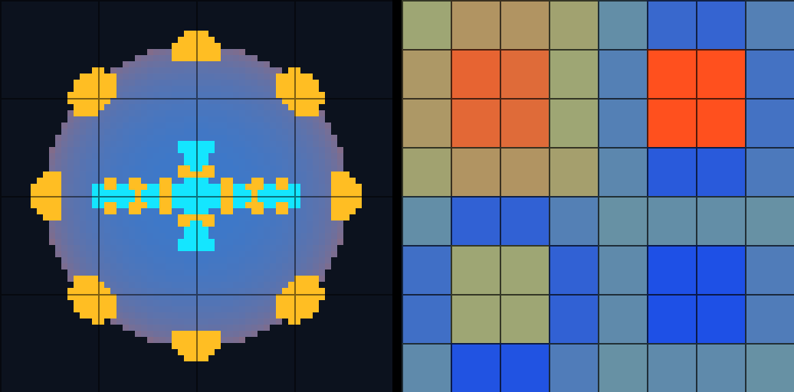

# RVA1 Run 3 — tile-local SDF recipe interval pruning

## LANDABLE NOW

- VIXEN run-3 tested base: `26cfdc7c7486d86c9c04120f58d62252f7f9f146` (`lane-rva1`). It contains the Run-2 feature commit `a53de758752ff06f1cf535064481d3d13c0f2dd6` and the wave merge `8ee92e5c848b4907ac93984e4a2bd99b830f6138`.
- Kernel: `f1ac3fb0f8aa71f98075fb33e35d035999c4f334`, based on merged `origin/main` `bd05ce51`.
- Untouched wave comparison tip: `846ab1a999a542f663ee08764fe69b3de2beade3`.
- Run 3 changes are in the VIXEN render-test fixture, this report, the capture below, and the lane-local SPT proposal. The kernel worktree is unchanged.

## Run 2 implementation carried into this run

- Kernel declarations add interval-rule metadata to `KernelCallableAttribute.cs` and declare Sphere, Box, hard Union, Subtract, and Intersect rules in `SdfCoreKernels.cs`.
- Kernel lowering validates opcode, stack shape, and data-slot bounds, then emits bounded postfix tape GLSL and generated dispatch metadata through CodegenTool.
- `RecipeTileSpecialization.h` evaluates conservative Sphere/Box intervals over object-local AABBs. It prunes only hard CSG branches proven irrelevant by strict interval separation; unsupported opcodes, invalid domains, and invalid operands return the original tape.
- VIXEN codegen checks the generated tape evaluator. CPU interval/fallback tests and the GPU full/pruned/unrolled parity fixture cover the library API. Runtime scene-host integration remains a follow-on.
- Run 2 previously recorded 973 SourceGenerator tests and 2,081 CodegenTool tests passed, with 2 CodegenTool tests skipped. Its capture set was 11/11 byte- and pixel-identical. Run 3 leaves the kernel worktree unchanged.

## Run 3 fixture

Both fixtures use a 64×64 ray image and 64 object-local tiles arranged 4×4×4. The GPU was an NVIDIA GeForce RTX 3060 Laptop GPU through WSL DZN. Each GPU median is the median of three timed renders after a warm-up render.

The Run-2 control retains its original 325-instruction recipe: one sphere in every tile and 324 off-tile terms. The realistic 433-instruction recipe has 32 internal edits later buried by a larger refill sphere; a raised cross plate, eight perimeter patches, and 20 studs; a round opening, four notches, and 20 pock cuts; plus 128 offscreen terms. The capture's amber overlay marks pixels added by the plate and patches. Cyan marks pixels changed by cuts. The adjacent panel shows retained counts for all 64 tiles across the four Z layers.

## Run 2 and Run 3 measurements

| Measure | Run-2 dead-terms control | Run-3 visible edit-heavy |
|---|---:|---:|
| Source instructions | 325 | 433 |
| Retained instructions per tile (min / median / max) | 1 / 1 / 1 | 7 / 42 / 123 |
| Retained-instruction histogram | `1:64` | See full histogram below |
| Hit pixels (full / pruned / unrolled) | 1,804 each / 4,096 | 2,036 each / 4,096 |
| Output-byte differences (full↔pruned / full↔unrolled) | 0 / 0 | 0 / 0 |
| Visible output pixels changed from reference | 0 | 544; pre-cut additions: 552, cuts: 148 |
| Clauses per pixel, all pixels (full → pruned) | 26,499.9 → 81.5381 | 32,658.5 → 3,909.15 |
| Clause reduction, all pixels | 99.6923% | 88.0302% |
| Clauses per hit pixel (full → pruned) | 10,205.4 → 31.4013 | 12,691.4 → 2,432.12 |
| GPU median, full / pruned / unrolled (ms) | 18.7105 / 0.113664 / 0.350208 | 24.022 / 2.55693 / 0.500736 |
| CPU specialization (ms) | 0.686309 | 2.28172 |
| Total cost: specialization + pruned GPU median (ms) | 0.799973 | 4.83864 |
| Interval proof evaluations | 20,800 | 27,712 |
| Pruned source instructions across tiles | 20,736 | 24,404 |
| Upload bytes, full / pruned (including tile ranges) | 43,412 / 8,960 | 57,668 / 437,168 |

The exact RGBA32F outputs match byte-for-byte for full, pruned, and unrolled paths in both fixtures. Depth, hit counts, and the three material/channel values also match. Proof work is included in the CPU specialization measurement and therefore in total cost. Total cost is CPU specialization plus the pruned GPU median; one-time shader compilation, the base/pre-cut visibility reference renders, and capture writing are excluded.

Run-3's per-tile histogram is `7:4, 9:2, 13:2, 17:4, 19:1, 21:1, 25:2, 27:2, 31:1, 33:3, 35:4, 39:1, 41:5, 43:4, 45:4, 73:7, 75:2, 77:1, 81:2, 83:4, 107:2, 109:1, 111:1, 123:4` (64 tiles total). Forty-five tiles retain at least 32 instructions.

For the realistic fixture, clause work falls by 88.03%, while the pruned GPU median is 5.1× the unrolled median and total measured cost is 9.7× the unrolled GPU median. The pruned tape upload is 7.6× the full-tape upload because retained instructions are duplicated across tile ranges. In this fixture, tile-local tape duplication and dynamic evaluation outweigh the clause reduction in measured execution time. The Run-2 control still demonstrates the large benefit when most source terms are provably irrelevant to every tile.

The final focused pass ran while another lane had a queued build active. Repeated GPU medians stayed close (`2.56 ms` pruned and `0.50 ms` unrolled); CPU specialization varied from `1.42` to `2.28 ms` with host load, and the table gives the final pass.

## Build and test record

- CodegenTool restore/build passed. Recipe generation reported no file changes, and the follow-up `--check` passed.
- Fresh full VIXEN build through the global queue passed; Ninja processed 209 build steps.
- Focused GPU fixture passed with the byte, depth/material/channel, visibility, and histogram gates. The final focused timing run is the one reported above.
- Full RenderGraph CTest passed: 1,337 tests, 0 failures, 6 skipped; 362.17 seconds wall time.
- Full SVO CTest: the sole failure was `RecipeSimdParity.AllCorpusProgramsAreBitIdenticalAcrossFourLanes`, with `M4d_Output_IsPassthrough: recipe gradient capability mismatch: 94`. The suite had 756 registered cases, 1 failure, 8 skipped, and 1 disabled.
- Full VIXEN CTest: the same opcode-94 test was the sole failure. CTest reported 1 failure among 2,876 counted tests, 13 skipped and 4 disabled, from 2,880 registered; 688.28 seconds wall time.
- The full suites ran before an indentation-only cleanup of the test body. After that cleanup, the focused target rebuilt and the full/pruned/unrolled GPU witness passed again.
- The opcode-94 failure reproduced on the untouched wave-tip snapshot at `846ab1a999a542f663ee08764fe69b3de2beade3`, with the same diagnostic. The pre-edit SVO baseline on this lane also showed it. This is the existing T-1449 issue; no other suite failure appeared.

## Recovery record

- Before semantic edits, the queued full SVO baseline failed only on opcode 94. Recovery rung C was completed: `ctest --test-dir build/wave-baseline/build/wsl --output-on-failure --parallel 1 -R '^RecipeSimdParity\.AllCorpusProgramsAreBitIdenticalAcrossFourLanes$'` was run against a fresh snapshot of the untouched wave tip and failed with the same diagnostic. This proves the red predates Run 3.
- Codegen recovery rung B was completed: queued CodegenTool restore/build and a fresh recipe generator run succeeded without changing generated files; the follow-up `--check` passed.
- The wave-tip snapshot configure succeeded with explicit kernel, Undertow, and FetchContent roots. It staged a source-local Vulkan SDK, X11 development files, and missing FetchContent projects before CTest could run. The lane proposal records this provisioning friction.
- The lane build reconfigured the CMake tree and rebuilt cached dependencies; it completed successfully. No generated recipe outputs changed during this run.

## CodeGraph and integration scope

VIXEN, the kernel worktree, and KernelFederationRenderer have no `.codegraph/` index; no index was created. VIXEN navigation used `rg`. KFR's `app/src/session_renderer.cpp` contains no SDF recipe consumer. `SessionRenderer::BuildRenderGraph()` remains the closest KFR host integration point for a future scene node.

The mixed voxel/virtual delta stack remains outside this recipe-only proof. The specializer has no ordered materialized-brick references, per-brick occupancy or min/max distance bounds, or revision linkage from that stack, so it cannot prove that a brick override or virtual clear leaves a recipe branch irrelevant. The recipe-only interval proof is implemented; rv-a2 owns the mixed-stack gap.

## Shared files touched

No cross-lane shared source files were changed. Run 3 modifies only the VIXEN SVO GPU render test, this report, the committed capture, and `.spt-proposals/rva1.jsonl`.

## STOPs

None. The only full-suite red is opcode 94 / T-1449, reproduced on the untouched wave tip. T-1449 remains open; this lane does not change or close it.

## SPT disposition

- `T-1449`: remains open for the opcode-94 recipe gradient capability mismatch.
- `T-1450`: keep the R328 interval-arithmetic follow-on open; this lane did not implement or close it.
- No existing SPT task was closed.

## CONSOLIDATION ISSUES (non-facade deltas this lane needed)

- proposed: CodegenTool tests should discover the Undertow root
- proposed: Standard VIXEN build should regenerate merged SDI before drift checks
- proposed: Kernel solution build exits successfully without discovering projects
- proposed: Capture script must resolve output directory before changing working directory
- proposed: Untouched wave baseline configure re-provisions Vulkan and X11 dependencies
