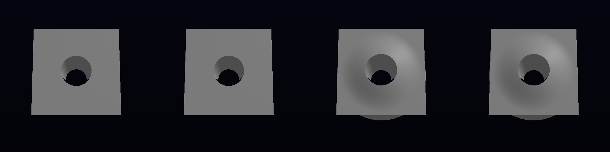
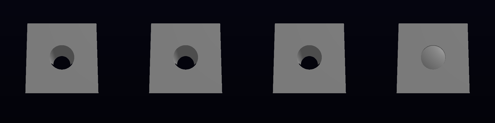
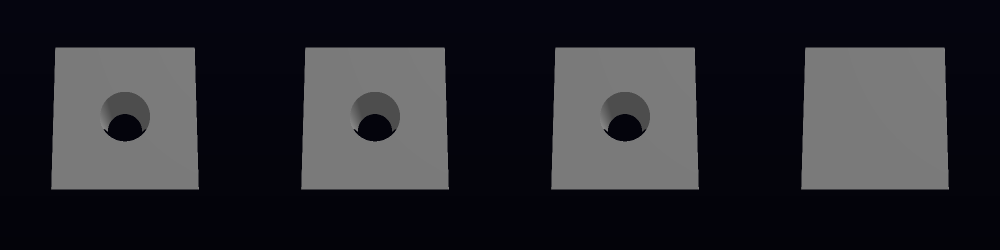
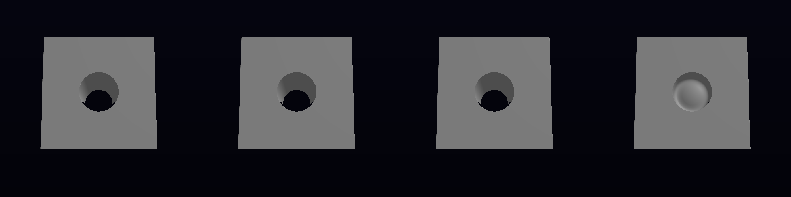

## LANDABLE NOW

Phase 1 is complete for five visible edit kinds, plus hidden/no-op findings. The landing candidate consists of opt-in phase measurement, captures, a tested shared selector repair, and the disabled-LOD invariant check hoist. The R465 editor/runtime evaluator transition has not been implemented, and the editor default remains unchanged.

The merged measurement base is VIXEN `0df161226bbc0bcfc397d4581967c8371c756760`, incorporating wave `c0e23a10` and run-1 asset-stamp repair `11434b33`. The tracked baseline kernel is `c3fb3847979e3f9eef04783510c42b70d7058ae7`. The kernel lane has also merged `origin/main` at `e8a1fdc04e3e02aee5848d7d932abb0022049837` before its next witness. No branch was created or switched, and neither repository was pushed.

### Phase 1: measured current path

`VIXEN_EDITOR_LATENCY_TRACE=1` emits separate `[RECIPE/latency]` timestamps around dispatch, flatten/bounds, registry mutation, shader requests, whole-pool baking, publication, graph recompilation/pipeline creation, octree materialization/upload, rendering, and capture readback. The R6 `[EDITOR/state]` format is unchanged. The analyzer rejects any live UI dispatch during a scripted capture. A repeated program-field capture was rejected because other X11 input deleted/created layers at ticks 33, 48 and 51; its log is retained in `before-program-binding-repair/`, but it is not a latency or roundtrip witness. Xvfb and dependencies were downloaded/extracted only under `.tmp/editor-latency-display`; startup could not bind the WSLg-owned `/tmp/.X11-unix` directory. That directory was not modified. This route is not yet a usable display witness. Seven analyzer tests and six binding tests passed.

The normal application does not emit the new trace when the diagnostic environment variable is absent.

The instrument uses `PreTick`/`PostTick` frame spans and the existing pre-composite scene capture. It reports CPU wall time through render submission/present return. It does not measure physical scanout or claim GPU execution time. Capture readback runs after the frame-end timestamp; it delays the following tick. The readback-completion column is a separate upper bound for having verified changed scene pixels. Nested registry/shader-request and render/materialization durations are shown separately without double-counting.

All cases use the configured, staged editor fixture, windowed X11, the top-down camera, Mesa-Dozen, a separate fresh worktree-local shader cache per case, and the fixture's `VIXEN_TEST_CELSHADE_LAMBERT_GGX=0`. They capture ticks 28–33, 58–63, 88–93, and 118–123. The launch tick is 30. This instrument's lighting setting differs from the native visual witness; compare each before/after pair with its identical instrument and settings.

| Edit | First changed tick | Presented frames including dispatch tick | CPU wall to frame end, ms | Compile/pipeline, ms | Whole-pool bake, ms | Materialize/upload, ms |
| --- | ---: | ---: | ---: | ---: | ---: | ---: |
| Toggle | 32 | 3 | 1560.855 | 1002.002 | 41.547 | 26.360 |
| Parameter, four nudges coalesced in one tick | 31 | 2 | 436.174 | 0 | 33.465 | 21.152 |
| Create | 32 | 3 | 17187.223 | 16576.131 | 24.389 | 16.173 |
| Delete | 32 | 3 | 1503.184 | 900.658 | 26.683 | 15.947 |
| Reorder | 32 | 3 | 29993.637 | 29208.895 | 41.820 | 34.312 |
| Single parameter nudge hidden inside box | No changed pixel in captured horizon | — | — | 0 | 28.181 | 16.657 |
| Program-field edit before binding repair | No mutation or changed pixel | — | — | 0 | 0 | 0 |

The full phase table, including undo/redo and readback completion, is [phase1-before-table.md](togglelatency-visual/phase1-before-table.md). Machine-readable traces are [before/measurements.json](togglelatency-visual/before/measurements.json) and [before-visible-parameter/measurements.json](togglelatency-visual/before-visible-parameter/measurements.json). Each case directory retains its raw log and original PNGs.

Flatten, baking, publication, and materialization occur in dispatch tick 30. Structural compilation occurs at tick 31. The first changed and first settled structural scene is tick 32. For the visible parameter edit, both are tick 31; it avoids compilation but still bakes the full pool. This is the measured failure of the requested first-presented-frame property, not a passing latency gate. Shared-host contention and readback overhead affect the wall times, so the report does not treat them as uncontended runtime benchmarks.

A single parameter nudge changes the radius from 0.6 to 0.75625 while the sphere remains hidden inside the slab. Four dispatches in tick 30 produce a visible radius of 1.225 and one published bake. The analyzer coalesces those dispatches and still records their count; it does not invent latency for an invisible edit.

The first program-field witness exposed a selector collision: `layer-2-program-up` matched `layer-{index}-up` first and extracted `2-program`. The old consumer converted that invalid index to zero, making reorder inert. Revision stayed 1 with no undo entry. The shared BindingStore now consults the existing registered integer parameter declaration, rejects partial/overflowing parses, and continues to the intended generated pattern. Its focused tests check both intended actions and trigger cause identities. The repaired action changed revision to 2 and added one undo entry in its repeated run, but foreign live input invalidated that capture. Numeric program data editing remains distinct from changing a CSG layer operator; the current document/editor action surface does not expose that operator mutation. No operator latency is claimed.

Toggle-back and structural undo return byte-identical initial PNGs. Undo/redo identities are recorded against both the initial and first edited settled PNG; they are independent of the first-change measurement. All structural and visible-parameter first changes match their later settled capture rather than a transient frame.

### Opened captures

The original 500×500 frames 29, 30, and 31 are retained. Contact sheets have four columns: ticks 29, 30, 31, and 33. For the parameter case, column three already contains the bulge; structural edits retain the original scene through column three.

I opened these contact sheets and the original delete frame 29. Decoded contact-sheet columns have the same object-support counts as the original PNGs. The carvefix reference was also opened; no cross-configuration shading identity is claimed.

### Required scope and recovery

The target includes the shared recipe evaluator/generator, its native SVO consumer, RenderGraph/editor consumers, the existing generation contracts, GPU full/pruned/unrolled parity, occupancy and rvcompact identity, the kernel suites, editor state/capture gates, and a no-op rebuild. A full-suite failure cannot be excluded because this brief explicitly requires the RenderGraph and SVO suites.

The merged fresh Release configuration/build passed all 22 codegen checks, including `view_noun_enum_check` and `appflow_check`; run 1's contract STOP is resolved. Configure log: `/home/liory/.local/state/undertow/undertow-box-logs/1791571205-light-run2-baseline-config-only.log`. Full build log: `/home/liory/.local/state/undertow/undertow-box-logs/1791571447-build-run2-baseline-build.log`.

The first full native suite on that base exited 8: the allowed opcode-94 gradient-capability failure plus `LODRayCastingTest.NoPerformanceRegressionWithoutLOD`. Log: `/home/liory/.local/state/undertow/undertow-box-logs/1791572055-test-run2-baseline-rendergraph-svo.log`. An isolated repeat failed on its first iteration: LOD 0.417573 ms versus ordinary traversal 0.191012 ms, with the unchanged 1.2× Release limit. Log: `/home/liory/.local/state/undertow/undertow-box-logs/1791572606-test-run2-baseline-lod-isolated.log`. This failure occurred before any SVO semantic edit.

Recovery A: verified the live global queue, nested VIXEN CMake root, provisioned SDK/windowing dependencies, native GCC Release flags, and supported Makefiles route. The alternate Ninja preset uses the same GCC Release target; there is no invocation/provisioning diagnostic to repair. Recovery B: the fresh build's generation contracts are green, so regeneration cannot repair the traversal timing failure. Recovery C: the source failure matches unchanged base SVO inputs, but the full SVO gate is required and cannot be excluded. The in-scope repair hoists the existing ray-invariant LOD enablement check outside the ESVO loop, after preserving the original body/GPU-mirror traversal choice. The timing gate was not relaxed. The focused, freshly built 16-test LOD suite passed, including strengthened exact hit identity. The recovered full native run passed the LOD gate and every remaining SVO test except the allowed opcode-94 failure. Its RenderGraph editor fixture timed out during device cleanup after reaching its 140-frame limit; nine dependent checks were not run. The unchanged fixture and consumers passed all 11 checks with `VIXEN_CACHE_DIR=$PWD/.tmp/editor-fixture-recovery-cache`: editor 76.53 seconds, HUD 143.37 seconds. No timeout was relaxed. Together with the recovered full run, all required native checks were exercised fresh; opcode 94 is the only remaining failure. Recovery log: `/home/liory/.local/state/undertow/undertow-box-logs/1791573551-test-run2-recovered-rendergraph-svo.log`.

The initial configure-only job was held by the queue's generic compile memory estimate. Its own waiting job was cancelled and the same configure was admitted as a light job; the real build remained in the build resource class. This provisioning friction is proposed for consolidation.

Kernel suites at the tracked c3 baseline passed: SourceGenerator 981/981, CodegenTool 2084 passed and 2 skipped. At merged e8, SourceGenerator again passed 981/981; CodegenTool passed 2087 with 2 skipped (2089 total). The helper could store SG attestations but not derive a CG reuse key even though both supplied paths resolve to git worktree roots; it ran CG fresh. No reused stale binary is claimed.

### Phase 2 findings and remaining work

The existing generated tape contains only five interval-rule operations and a local 64-float stack. Its GPU parity adapter silently calls the unrolled function when tape evaluation fails. Full coverage must remove this fallback and compare actual field/declared-position bytes, including typed bit payloads and invocation closure, against the splice. The new evaluator must continue to derive callable arguments and control behavior from RecipeLoweringModel, use actual register depth, and keep workgroups coherent when loading shared tape chunks. Tile-pruned tapes and the existing instance-bucketing shader are the existing mechanisms to use.

No hand edit of generated GLSL, layer on/off mask, new attribute, kind, registry, or editor default switch has been introduced. Phases 2–5 and their runtime first-frame, swap, static-instance counter, live bounds, and partial RevalidateShellBricks properties remain unfinished. Interpreter/hybrid/full-unroll and background-swap measurements are not yet available.

KFR follow-up belongs at its existing renderer session graph assembly in `app/src/session_renderer.cpp`; KFR is read-only for this lane. The capability must remain in VIXEN's shared libraries rather than an editor-only path.

### Authoring audit

CodeGraph was attempted first. VIXEN has no index; the documented helper confirmed that, so searches used rg. Kernel explore was attempted before code reads. The generated operation-table shapes were inspected through the existing emitter and metadata. No new facade kind, dispatch signature, identity field, pipe, ordering hint, attribute, or reference family is currently added. Instrumentation copies the existing editor capture lifecycle; BindingStore consults the generated action parameter schema already registered by RegisterActions. The handwritten LOD and binding repairs are incidental non-facade work and have separate proposals.

## SPT DISPOSITION

No dispatched SPT task ID is named in this brief. R463/R465 are owner rulings, not closable SPT tasks. The requested latency work is PARTIAL; no task closure is requested. The existing T-1449/opcode-94 failure is reported as the permitted finding, not closed.

## CONSOLIDATION ISSUES (non-facade deltas this lane needed)

- proposed: Classify VIXEN configure separately from compilation for queue memory admission
- proposed: Identify the non-root input when kernel CodegenTool witness reuse fails
- proposed: Disabled LOD enablement was checked inside every ESVO traversal iteration
- proposed: Selector pattern resolution ignored its declared integer parameter type
- proposed: Scripted windowed editor witnesses need isolated X11 input
- proposed: Full native capture fixture needs a documented isolated shader-cache contract
