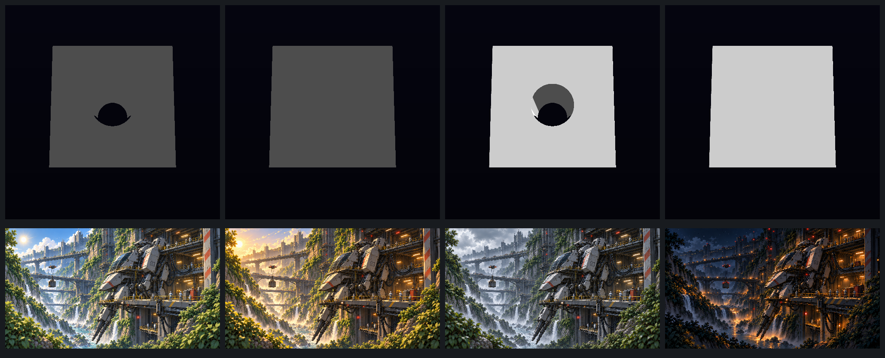

# wavebump — VIXEN wave onto kernel c3fb384

## LANDABLE NOW

**State: STOP — not landable yet.** The editor reference change is approved by R458 and the visual artifacts are ready, but the three non-editor HUD captures changed from the wave parent. R458 requires those captures to remain byte-identical. The HUD delta reproduced on a second merged-tree capture run, so it is not capture noise. The remaining action is to identify how the merge changes the HUD scene and either restore identity or get explicit approval to rebaseline HUD as well.

- Starting wave base: `dc2ea8828b887b71c183282d09f460463e63bc00`.
- Integrated tree tip: `78997a466c182fb96af6a92f2d5d0cf1a65b956e` on `lane-wavebump`.
- Merge order and commits:
  1. `db16805baf59286f0ecfa0cd34790c12dc26c2f2` — merge `lane-bswave` (pin to `c3fb384` and boundscore).
  2. `78997a466c182fb96af6a92f2d5d0cf1a65b956e` — merge `lane-wavereds` (SIMD/GLSL outputs and corpus `paramMask` fix).
- Kernel pin: `c3fb3847979e3f9eef04783510c42b70d7058ae7`; `VIXEN_YEROKET_KERNEL_SHA_OVERRIDE` is empty.
- The merge had no conflicts. The documented `recipe_simd_regen` and `sdf_core_kernels_regen` targets ran after both merges and reported no output changes.
- The approved editor captures and the parent references are stored in `reports/wavebump-visual/captures/{wave,merged}/editor/`. The complete before/after set, including HUD, is also retained under the same capture root.

### Capture sheet and R427 review

The sheet’s top row is wave frame 5, wave frame 45, merged frame 5, merged frame 45. The bottom row is R2-01 midday, R2-02 late afternoon, R2-03 overcast, and R2-04 night/service. These are direction references for T01, T13, T15, and T21, from `/home/liory/codeman-cases/undertow/reports/visual/iterations/lighting/`.

The source fixtures are the 500×500 sample tri-layer editor document, not a representative world scene. On merged `editor_capture_5.png`, luma p5/p50/p95 is `0.0135 / 0.0222 / 0.8000`; emissive share is `0.0000%`. The nearly black frame and sparse cube make the reference-world daylight values unsuitable as a lighting verdict. Shared defaults remain 3 cel bands, softness `0.08`, hue shift `+18°/-18°`; no owner-tuned parameter changed.

| Bible §7 step | Result | Observation |
|---|---|---|
| 1. Log the frame | N/A | 500×500, frame 5, sample tri-layer VXD; no time-of-day, distance regime, star, atmosphere, or world-material metadata. |
| 2. Shared light set | N/A | The editor uses the shared graph, but this fixture does not show enough lit surfaces or shadows to trace. |
| 3. Value range | FAIL | p5/p50/p95 `0.0135 / 0.0222 / 0.8000`; the median remains far below the midday target because most of the frame is black. |
| 4. Depth by haze | N/A | No atmosphere or terrain depth layers. |
| 5. Domain split | N/A | No representative nature and machine subjects. |
| 6. Voxel step | N/A | No foliage, rock, excavation, or orbit scene. |
| 7. Intrusion read | N/A | No faction site or biome comparison. |
| 8. Machine lights | N/A | No emitter fixtures; emissive share is zero. |
| 9. Weight | N/A | No machine or human-scale reference. |
| 10. Silhouette | N/A | The cube reads as a fixture shape, not a hero machine or structure. |
| 11. Materials | N/A | No representative rock, metal, ice, or vegetation set. |
| 12. Scale | N/A | No person or familiar scale object. |
| 13. Clean frame | PASS | The editor capture has no abstract HUD overlay or magenta neon. |
| 14. Hull colour | N/A | No machine hull. |
| 15. Edges | N/A | No representative nature, machine-plate, or excavation edges. |
| 16. Extraction read | N/A | No mined site or untouched comparison area. |

The remaining visual limitation is the fixed editor framing and sample-only subject; a camera zoom/framing change would make future lighting and silhouette checks useful. This lane does not alter those defaults.

### Capture identity

The wave parent was freshly built from an archive of `dc2ea882` in Release with its tracked `77574f2…` kernel pin. Its four editor captures match the staged wave references byte-for-byte. The merged native capture script completed twice with the same output hashes.

| Capture | Byte difference | Pixel difference | Maximum channel delta | Bounds |
|---|---:|---:|---:|---|
| Editor 105 / 45 | 6,558 | 81,496 / 250,000 | 178 | x=103..397, y=95..378 |
| Editor 5 / 75 | 7,447 | 74,187 / 250,000 | 178 | x=103..397, y=95..378 |
| HUD 45 | 25,103 | 4,694 / 250,000 | 148 | x=86..441, y=187..279 |
| HUD 5 | 25,100 | 4,694 / 250,000 | 148 | x=86..441, y=187..279 |
| HUD 75 | 25,070 | 4,694 / 250,000 | 148 | x=86..441, y=187..279 |

The editor deltas reproduce the approved R458 findings. The HUD captures fail the byte-identity rule. All seven merged captures were byte-identical between the two merged-tree runs. Wave and merged raw PNGs and SHA256 values are retained under `reports/wavebump-visual/captures/` for review.

## Generation and Release build

The generated-file gates and full Release build ran with the tracked `c3fb384` pin and no override. All 22 `*_check` targets passed in the clean build:

`octreeconfig_check`, `recipeparams_check`, `recipe_simd_check`, `sdf_core_kernels_check`, `recipe_opcode_mirror_check`, `lightingconfig_check`, `shadowconfig_check`, `accumulationconfig_check`, `prevcameraconfig_check`, `reservoirconfig_check`, `probegridconfig_check`, `lighttreebuffer_check`, `miningbeambuffer_check`, `reservoirrecord_check`, `view_hud_check`, `view_editor_layers_check`, `view_hud_markup_check`, `view_hud_blob_check`, `view_hud_writer_check`, `appflow_check`, `view_noun_enum_check`, and `callables_check`.

The clean Release build completed 1,147 actions. CMake configuration needed a worktree-local `Include -> include` symlink because the provisioned Vulkan SDK has lowercase `include/glslang` while the finder probes `Include/glslang`; the configure was rerun through the light queue. This casing issue is already covered by the existing VIXEN SPT proposal “Make the Vulkan SDK glslang include lookup case-tolerant.”

## Test witnesses

- Combined `RenderGraph|SVO`, CTest `--parallel 8`: 2,114 selected. Its only failure is the documented T-1449 case `RecipeSimdParity.AllCorpusProgramsAreBitIdenticalAcrossFourLanes`, with `M4d_Output_IsPassthrough: recipe gradient capability mismatch: 94`. This matches the bswave and wavereds reports; there were no other RenderGraph/SVO failures. CTest also listed 19 skipped and one disabled case.
- Boundscore occupancy exactness passed all four fixtures; each generated reduction is byte-identical to its dense oracle.

  | Fixture | Exact / sampled cells | Points dense → generated | Median dense → generated |
  |---|---:|---:|---:|
  | Sphere | 1,160 / 2,936 | 262,144 → 201,584 | 1.95668 → 1.50187 ms |
  | Box | 760 / 3,336 | 262,144 → 221,375 | 3.16181 → 2.93130 ms |
  | Union | 832 / 3,264 | 262,144 → 220,764 | 2.77798 → 2.25529 ms |
  | Subtract | 1,452 / 2,644 | 262,144 → 187,872 | 2.71662 → 1.61445 ms |

- rvcompact GPU identity passed. Dead terms compacted 325 → 1 instruction and measured 0 differing output bytes; visible edit compacted 433 → 177 and also measured 0 differing output bytes. Depth and fixture RGB were identical to the unrolled oracle.
- Native captures completed twice. The editor pair identities are 5=75 and 45=105 in both runs. HUD and editor outputs are deterministic; only the editor changes are approved by R458.
- The broad CTest run included the editor capture producer, which temporarily changed tracked `VIXEN/BuiltAssets/documents/sample_tri_layer.edited.vxd`. The test-mutated SHA was `d3f47d547019ddb187a9bb03a1a4dae9fecb88a88fcb87d28926b45aaf5e4ba9`; it was restored to its initial SHA `61944efc2220d22976d79ad2e932252a9e189fc42d49d1f6afbf70db64dca3d8`. The final native capture run did not change it.
- The first queued final rebuild, after the parent baseline had shared `.tmp/fetch`, reconfigured the merged tree and rebuilt 506 of 509 actions. A second queued build then returned `ninja: no work to do.` This cache interaction is filed as the new consolidation issue below.

Evidence logs are under `/home/liory/.local/state/undertow/undertow-box-logs/`: clean build `1791554058-build-wavebump-clean-release-all-checks.log`; combined tests `1791555392-test-wavebump-rendergraph-svo-full.log`; occupancy `1791555751-test-wavebump-boundscore-occupancy-cost.log`; rvcompact `1791555756-test-wavebump-rvcompact-identity.log`; wave-parent build/captures `1791556492-build-wavebump-wave-reference-apps.log` and `1791557128-test-wavebump-wave-reference-captures.log`; merged captures `1791555787-test-wavebump-native-captures.log` and repeat `1791557231-test-wavebump-native-captures-repeat.log`; final stable no-op `1791557747-build-wavebump-final-noop2.log`.

## STOPs and disposition

- **STOP — capture reference gate:** HUD frames 5, 45, and 75 differ from the freshly built wave parent. R458 only authorizes the editor rebaseline. Before landing, either make the HUD captures byte-identical or obtain explicit approval to expand the capture baseline. The source of the HUD delta has not been isolated to a specific generated expression.
- T-1449 remains the sole expected CTest failure and remains open.
- No KFR files changed. The read-only follow-up call site remains `KernelFederationRenderer/app/src/session_renderer.cpp`, `SessionRenderer::BuildRenderGraph()` near line 28.
- The current editor reference images and visual report are committed for review, but this tree is not ready to land until the HUD gate is resolved.

## SPT disposition

No SPT task is closed here. T-1449 remains open. The HUD identity STOP needs an owner/orchestrator decision or a source fix before landing.

## CONSOLIDATION ISSUES (non-facade deltas this lane needed)

- proposed: Isolate FetchContent build state between VIXEN build trees
